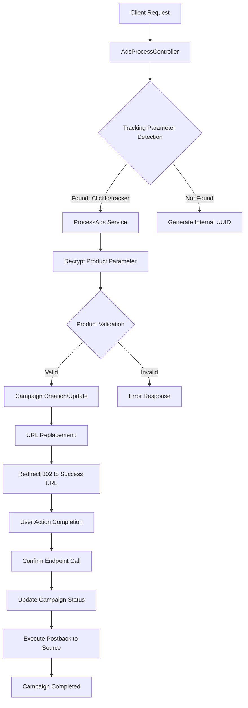

# 🏗️ Arquitectura Técnica - Xafra-Ads

## 📋 Visión General del Sistema

Xafra-Ads es una plataforma de promoción de servicios digitales que actúa como intermediario entre fuentes de tráfico (traffic sources) y operadores de telecomunicaciones. El sistema procesa campañas publicitarias, gestiona tracking IDs, y ejecuta postbacks de confirmación para cerrar el ciclo de conversión.

### 🎯 Objetivos Arquitectónicos
- **Modularidad**: Separación clara de responsabilidades por módulos especializados
- **Escalabilidad**: Preparado para alto volumen de transacciones (2.9M+ campañas)
- **Mantenibilidad**: Código limpio y bien estructurado con patrones empresariales
- **Flexibilidad**: Soporte para múltiples clientes, productos y campañas
- **Reliability**: Sistema robusto de tracking y confirmación de conversiones

## 🏛️ Arquitectura de Alto Nivel

```
┌─────────────────────────────────────────────────────────────┐
│              TRAFFIC SOURCES & CLIENTS                      │
│       (Web, Mobile, API Consumers, Ad Networks)            │
└─────────────────────┬───────────────────────────────────────┘
                      │ Campaign URLs with tracking params
┌─────────────────────▼───────────────────────────────────────┐
│                 WEB LAYER                                   │
│           webapp-xafra-ads (Spring Boot)                   │
│  ┌─────────────────┬─────────────────┬─────────────────┐   │
│  │  Controllers    │   Processors    │    Security     │   │
│  │  • AdsProcess   │   • ProcessAds  │   • AuthFilter  │   │
│  │  • AutoSubs     │   • TrackingID  │   • API Keys    │   │
│  │  │  Confirm     │   • Validation  │   • Encryption  │   │
│  │  • Utilities    │   • Postbacks   │   • Headers     │   │
│  └─────────────────┴─────────────────┴─────────────────┘   │
└─────────────────────┬───────────────────────────────────────┘
                      │ Business Logic & Data Processing
┌─────────────────────▼───────────────────────────────────────┐
│               BUSINESS LAYER                                │
│              db-access (JDBI ORM)                          │
│  ┌─────────────────┬─────────────────┬─────────────────┐   │
│  │    Entities     │      DAOs       │   Business      │   │
│  │  • Campaign     │   • ICampaignBI │   • BlackList   │   │
│  │  • Product      │   • IProductBI  │   • AutoSubs    │   │
│  │  • Customer     │   • IUserBI     │   • Postbacks   │   │
│  │  • BlackList    │   • IBlackListBI│   • Tracking    │   │
│  └─────────────────┴─────────────────┴─────────────────┘   │
└─────────────────────┬───────────────────────────────────────┘
                      │ External Integrations & Postbacks  
┌─────────────────────▼───────────────────────────────────────┐
│               INTEGRATION LAYER                             │
│         Traffic Sources & Telecom Operators               │
│  ┌─────────────────┬─────────────────┬─────────────────┐   │
│  │   Postback APIs │   AutoSubscribe │   Blacklist     │   │
│  │  • URL Replace  │   • CSV Process │   • MSISDN      │   │
│  │  • <TRACKING>   │   • ENTEL API   │   • Validation  │   │
│  │  • Async Calls  │   • Threading   │   • Filtering   │   │
│  └─────────────────┴─────────────────┴─────────────────┘   │
└─────────────────────┬───────────────────────────────────────┘
                      │ Data Persistence & Tracking Storage
┌─────────────────────▼───────────────────────────────────────┐
│               DATA LAYER                                    │
│            PostgreSQL 13 (GCP - 34.28.245.62)            │
│  ┌─────────────────┬─────────────────┬─────────────────┐   │
│  │    Tables       │    Tracking     │   Operations    │   │
│  │  • campaigns    │   • 2.9M+ recs  │   • CRUD        │   │
│  │  • products     │   • Status mgmt │   • Bulk Ops    │   │
│  │  • customers    │   • Timestamps  │   • Transactions│   │
│  │  • blacklist    │   • Relations   │   • Indexing    │   │
│  │  • xafra_camp   │   • Foreign     │   • Performance │   │
│  └─────────────────┴─────────────────┴─────────────────┘   │
└─────────────────────────────────────────────────────────────┘
```

## 🔄 Flujo de Negocio Principal

### 🎯 Workflow de Campaña Publicitaria

```mermaid
graph TD
    A[Traffic Source] -->|Campaign URL + Tracking ID| B[/ads/{param}/]
    B --> C{Decrypt & Validate}
    C -->|Valid| D[Get Product Config]
    C -->|Invalid| E[Error Response]
    D --> F{Product Exists?}
    F -->|No| G[Redirect Error]
    F -->|Yes| H[Generate/Validate Tracking]
    H --> I{Tracking ID Type}
    I -->|External| J[Use Provided ID]
    I -->|Internal| K[Generate UUID]
    J --> L[Create Campaign Record]
    K --> L
    L --> M[Replace <TRAKING> in URL]
    M --> N[Redirect to Success URL]
    N --> O[User Completes Action]
    O --> P[/ads/confirm/{tracking}]
    P --> Q[Update Campaign Status]
    Q --> R[Execute Postback to Source]
    R --> S[Campaign Complete]
```

### 📊 Estructura de Datos Jerárquica

```
Customer (Cliente)
├── Products (Productos del Cliente)
│   ├── urlRedirectSuccess (URL de contratación)
│   ├── urlRedirectPostBack (URL de postback)
│   ├── methodPostBack (GET/POST)
│   └── Campaigns (Campañas por Producto)
│       ├── trackingId (ID de seguimiento)
│       ├── productId (Relación al producto)
│       ├── status (PROCESSING/PROCESSED)
│       ├── statusPostBack (0/1)
│       └── timestamps (Fechas de creación/actualización)
```

### 🔍 Tracking Parameters Soportados

El sistema reconoce automáticamente los siguientes parámetros de tracking en las URLs:

```java
// Parámetros reconocidos (case-sensitive)
"ClickId"   - Estándar de la industria
"clickId"   - Variante camelCase  
"ClickID"   - Variante uppercase
"clickID"   - Variante mixta
"tracker"   - Parámetro genérico
```

**Flujo de Reconocimiento**:
1. Sistema recibe URL con query parameters
2. Busca primer parámetro disponible de la lista anterior
3. Extrae valor del tracking ID
4. Procesa campaña con tracking ID identificado

### 🎯 Módulos Especializados

#### 🟢 Módulo BlackList
**Propósito**: Control de números telefónicos (MSISDN) para prevenir duplicados
**Funcionalidades**:
- Validación pre-suscripción contra blacklist
- Inserción automática en blacklist post-suscripción exitosa
- Filtrado por productId para control granular
- Soporte para diferentes tipos de blacklist

#### 🔄 Módulo AutoSuscripción  
**Propósito**: Procesamiento masivo automatizado de suscripciones
**Características**:
- Lectura de archivos CSV con números MSISDN
- Procesamiento en threading para alta performance
- Integración con API ENTEL para activación de servicios
- Control de límites y horarios de procesamiento
- Filtrado automático contra blacklist

## 🧩 Módulos del Sistema

### 📱 webapp-xafra-ads
**Propósito**: Capa de presentación y API REST  
**Tecnologías**: Spring Boot 2.7.18, Spring MVC, Thymeleaf  
**Responsabilidades**:
- Manejo de peticiones HTTP
- Validación de entrada
- Transformación de datos
- Manejo de sesiones y seguridad

**Componentes Clave**:
```java
// Controllers
@RestController AdsProcessController
@RestController AutoSubscribeController  
@RestController UtilController

// Services
@Service ProcessAds
@Service ProcessAdsConfirm
@Service ValidationService

// Configuration
@Configuration DatabaseConfig
@Configuration SecurityConfig
```

### 💾 db-access
**Propósito**: Capa de acceso a datos y entidades de negocio  
**Tecnologías**: JDBI 3.x, PostgreSQL Driver  
**Responsabilidades**:
- Mapeo objeto-relacional
- Transacciones de base de datos
- Cache de entidades
- Consultas optimizadas

**Estructura de Entidades**:
```java
// Core Entities
public class Campaign
public class Product  
public class User
public class Ad

// Business Interfaces
interface ICampaignBI
interface IProductBI
interface IUserBI

// Cache Layer
class LocalCache<T>
class CacheImplementation
```

### 🛠️ commons-help
**Propósito**: Utilidades compartidas y funciones transversales  
**Tecnologías**: Java 8, Lombok, Apache Commons  
**Responsabilidades**:
- Encriptación y seguridad
- Utilidades de string y fecha
- Manejo de concurrencia
- Sistema de logging

**Utilidades Principales**:
```java
// Security
public class Encryption
public class SecurityUtils

// Concurrency
public class ConcurrencyUtils
public class ThreadSafeOperations

// Logging
public class LogContent
public class StructuredLogger
```

## 🌐 API REST Design

### 📊 Endpoints Principales

#### 🎯 Procesamiento de Campañas
```http
GET  /ads/{param}/                      - Procesamiento principal de ads
     - param: Parámetro encriptado con ID del producto
     - Query params: tracking IDs (ClickId, clickId, tracker, etc.)
     - Response: Redirect 302 a URL de contratación con tracking

GET  /ads/confirm/{tracking}            - Confirmación de conversión
     - tracking: ID de seguimiento de la campaña
     - Response: Actualiza status campaña y ejecuta postback

POST /ads/v1/confirm/{apikey}/{tracking} - Confirmación con autenticación
     - apikey: Clave de API para autenticación
     - tracking: ID de seguimiento
     - Response: Confirmación autenticada con postback
```

#### 🔄 Auto-Suscripción Masiva
```http
POST /v1/auto/subscribe/{productId}     - Suscripción automática básica
POST /v1/auto/subscribe/{productId}/{hour}/{time}/{source}/{limit}
     - productId: ID del producto a suscribir
     - hour: Hora de procesamiento (default: "23")
     - time: Tiempo de espera entre requests (default: 10)
     - source: Código fuente (default: "AA230")  
     - limit: Límite de números a procesar

GET  /v1/ping                           - Health check (responde "pong")
```

#### 🛠️ Servicios Utilitarios
```http
POST /util/encryption                   - Servicio de encriptación AES
     - Body: Texto a encriptar
     - Response: Texto encriptado

GET  /util/get                          - Obtener URL base del sistema
     - Response: URL base configurada
```

#### 🔍 Testing y Desarrollo (DatabaseTestController)
```http
GET  /v1/db/test-connection             - Test conectividad BD
GET  /v1/db/test-data-access            - Test acceso a datos
GET  /v1/db/test-campaigns              - Test tabla campaigns (2.9M+ registros)
GET  /v1/db/health                      - Health check completo BD
```

### 🔄 Flujo de Procesamiento



## 🔧 Configuración y Deployment

### 🐳 Profiles de Entorno

**Desarrollo**:
```properties
spring.profiles.active=dev
server.port=8083
logging.level.root=DEBUG
logging.level.com.develop.job=DEBUG

# Database Development (Local/Testing)
spring.datasource.url=jdbc:postgresql://localhost:5432/xafra_dev
spring.datasource.username=dev_user
spring.datasource.password=dev_password
```

**Producción**:
```properties
spring.profiles.active=prod
server.port=8080
logging.level.root=INFO
logging.level.com.develop.job=INFO

# Database Production (GCP)
spring.datasource.url=jdbc:postgresql://34.28.245.62:5432/xafra-ads
spring.datasource.username=${DB_USERNAME}
spring.datasource.password=${DB_PASSWORD}
spring.datasource.driver-class-name=org.postgresql.Driver

# Database Pool Configuration
spring.datasource.hikari.maximum-pool-size=10
spring.datasource.hikari.minimum-idle=5
spring.datasource.hikari.connection-timeout=20000
spring.datasource.hikari.idle-timeout=300000

# JDBI Configuration
jdbi.autoCommit=false
jdbi.transactionIsolation=READ_COMMITTED
```

### 📈 Métricas y Monitoreo

**Health Checks**:
- `/v1/ping` - Application health (responde "pong")
- `/v1/db/health` - Database connectivity y performance
- `/v1/db/test-campaigns` - Validación datos críticos (2,970,685 campañas)
- Spring Boot Actuator endpoints disponibles

**Database Metrics**:
```sql
-- Estadísticas actuales validadas
SELECT COUNT(*) FROM campaigns;          -- 2,970,685 registros
SELECT version();                        -- PostgreSQL 13.21
SELECT current_database();               -- xafra-ads
SELECT current_user;                     -- Usuario de conexión
```

**Logging Strategy**:
- Structured JSON logging
- Separate log files por módulo
- Log rotation automático
- Error tracking y alertas

## 🔒 Seguridad

### 🛡️ Capas de Seguridad

1. **Transport Security**: HTTPS/TLS
2. **Input Validation**: Sanitización de entrada
3. **Authentication**: API Keys y tokens
4. **Authorization**: Role-based access
5. **Data Encryption**: AES para datos sensibles

### 🔐 Encriptación

```java
// Ejemplo de uso
Encryption encryption = new Encryption();
String encrypted = encryption.encrypt("sensitive_data");
String decrypted = encryption.decrypt(encrypted);
```

## 📊 Performance y Escalabilidad

### ⚡ Optimizaciones

**Cache Strategy**:
- In-memory cache para consultas frecuentes
- TTL configurable por tipo de dato
- Cache invalidation inteligente

**Database Optimization**:
- Indexes estratégicos
- Connection pooling
- Query optimization
- Prepared statements

**Resource Management**:
- Thread pools configurables
- Memory management
- CPU-bound vs I/O-bound operations

### 📈 Scaling Patterns

**Horizontal Scaling**:
- Stateless design
- Load balancer ready
- Database connection management
- Session externalization

**Vertical Scaling**:
- JVM tuning
- Memory optimization
- CPU utilization
- I/O optimization

## 🧪 Testing Strategy

### 🔬 Niveles de Testing

**Unit Tests**:
- Controllers con MockMvc
- Services con mocks
- Utilities aisladas
- 80%+ code coverage

**Integration Tests**:
- Database connectivity
- API endpoint testing
- External service integration
- End-to-end workflows

**Performance Tests**:
- Load testing
- Stress testing
- Capacity planning
- Response time SLAs

## 🚀 Roadmap Técnico

### 📅 Fase 1 (Actual) - v0.0.1
- ✅ Core functionality
- ✅ Basic REST API
- ✅ Database integration
- ✅ Deployment ready

### 📅 Fase 2 - v0.1.0
- 🔄 Complete database testing
- 🔄 Security hardening
- 🔄 Performance optimization
- 🔄 Monitoring integration

### 📅 Fase 3 - v0.2.0
- 📋 Microservices migration
- 📋 Container orchestration
- 📋 CI/CD pipeline
- 📋 Auto-scaling

### 📅 Fase 4 - v1.0.0
- 📋 Production deployment
- 📋 Full monitoring suite
- 📋 Disaster recovery
- 📋 High availability

---

📚 **Documentación**: Ver README.md para detalles de instalación  
🔧 **Configuración**: Ver INSTALL.md para setup rápido  
🐛 **Issues**: https://github.com/xamircastel/xafra-ads/issues  
📊 **Métricas**: Dashboard interno en desarrollo
