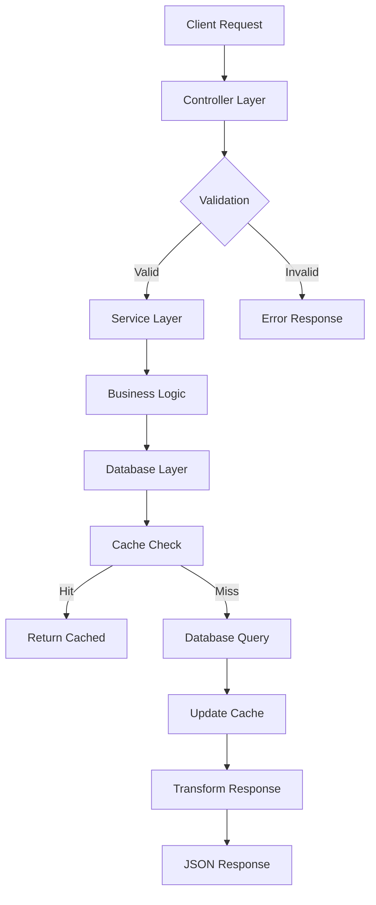

# 🏗️ Arquitectura Técnica - Xafra-Ads

## 📋 Visión General del Sistema

Xafra-Ads es una aplicación empresarial de procesamiento de anuncios digitales construida con arquitectura modular, diseñada para escalabilidad y mantenibilidad.

### 🎯 Objetivos Arquitectónicos
- **Modularidad**: Separación clara de responsabilidades
- **Escalabilidad**: Preparado para crecimiento horizontal
- **Mantenibilidad**: Código limpio y bien estructurado
- **Flexibilidad**: Fácil integración de nuevas funcionalidades

## 🏛️ Arquitectura de Alto Nivel

```
┌─────────────────────────────────────────────────────────────┐
│                    FRONTEND/CLIENTS                         │
│            (Web, Mobile, API Consumers)                     │
└─────────────────────┬───────────────────────────────────────┘
                      │
┌─────────────────────▼───────────────────────────────────────┐
│                 WEB LAYER                                   │
│           webapp-xafra-ads (Spring Boot)                   │
│  ┌─────────────────┬─────────────────┬─────────────────┐   │
│  │  Controllers    │   Services      │    Config       │   │
│  │  • AdsProcess   │   • ProcessAds  │   • Security    │   │
│  │  • AutoSubs     │   • Validation  │   • Database    │   │
│  │  • Utilities    │   • Business    │   • Logging     │   │
│  └─────────────────┴─────────────────┴─────────────────┘   │
└─────────────────────┬───────────────────────────────────────┘
                      │
┌─────────────────────▼───────────────────────────────────────┐
│               BUSINESS LAYER                                │
│              db-access (JDBI ORM)                          │
│  ┌─────────────────┬─────────────────┬─────────────────┐   │
│  │    Entities     │      DAOs       │     Cache       │   │
│  │  • Campaign     │   • ICampaignBI │   • LocalCache  │   │
│  │  • Product      │   • IProductBI  │   • CacheImpl   │   │
│  │  • User         │   • IUserBI     │   • Memory      │   │
│  └─────────────────┴─────────────────┴─────────────────┘   │
└─────────────────────┬───────────────────────────────────────┘
                      │
┌─────────────────────▼───────────────────────────────────────┐
│               UTILITY LAYER                                 │
│            commons-help (Shared Utils)                     │
│  ┌─────────────────┬─────────────────┬─────────────────┐   │
│  │   Encryption    │   Concurrency   │    Logging      │   │
│  │  • AES/DES      │   • ThreadSafe  │   • LogContent  │   │
│  │  • Base64       │   • Async       │   • Structured  │   │
│  │  • Security     │   • Pool        │   • Rotation    │   │
│  └─────────────────┴─────────────────┴─────────────────┘   │
└─────────────────────┬───────────────────────────────────────┘
                      │
┌─────────────────────▼───────────────────────────────────────┐
│               DATA LAYER                                    │
│            PostgreSQL 13 (GCP)                            │
│  ┌─────────────────┬─────────────────┬─────────────────┐   │
│  │    Tables       │    Indexes      │   Procedures    │   │
│  │  • campaigns    │   • Performance │   • Business    │   │
│  │  • products     │   • Search      │   • Analytics   │   │
│  │  • users        │   • Foreign     │   • Reports     │   │
│  └─────────────────┴─────────────────┴─────────────────┘   │
└─────────────────────────────────────────────────────────────┘
```

## 🧩 Módulos del Sistema

### 📱 webapp-xafra-ads
**Propósito**: Capa de presentación y API REST  
**Tecnologías**: Spring Boot 2.7.18, Spring MVC, Thymeleaf  
**Responsabilidades**:
- Manejo de peticiones HTTP
- Validación de entrada
- Transformación de datos
- Manejo de sesiones y seguridad

**Componentes Clave**:
```java
// Controllers
@RestController AdsProcessController
@RestController AutoSubscribeController  
@RestController UtilController

// Services
@Service ProcessAds
@Service ProcessAdsConfirm
@Service ValidationService

// Configuration
@Configuration DatabaseConfig
@Configuration SecurityConfig
```

### 💾 db-access
**Propósito**: Capa de acceso a datos y entidades de negocio  
**Tecnologías**: JDBI 3.x, PostgreSQL Driver  
**Responsabilidades**:
- Mapeo objeto-relacional
- Transacciones de base de datos
- Cache de entidades
- Consultas optimizadas

**Estructura de Entidades**:
```java
// Core Entities
public class Campaign
public class Product  
public class User
public class Ad

// Business Interfaces
interface ICampaignBI
interface IProductBI
interface IUserBI

// Cache Layer
class LocalCache<T>
class CacheImplementation
```

### 🛠️ commons-help
**Propósito**: Utilidades compartidas y funciones transversales  
**Tecnologías**: Java 8, Lombok, Apache Commons  
**Responsabilidades**:
- Encriptación y seguridad
- Utilidades de string y fecha
- Manejo de concurrencia
- Sistema de logging

**Utilidades Principales**:
```java
// Security
public class Encryption
public class SecurityUtils

// Concurrency
public class ConcurrencyUtils
public class ThreadSafeOperations

// Logging
public class LogContent
public class StructuredLogger
```

## 🌐 API REST Design

### 📊 Patrones de URL

```
/v1/*                    - API versionada principal
/ads/*                   - Procesamiento de anuncios
/util/*                  - Servicios utilitarios
/adsDep/*               - Dependencias y debug
```

### 🔄 Flujo de Procesamiento



## 🔧 Configuración y Deployment

### 🐳 Profiles de Entorno

**Desarrollo**:
```properties
spring.profiles.active=dev
database.url=jdbc:postgresql://localhost:5432/xafra_dev
server.port=8083
logging.level=DEBUG
```

**Producción**:
```properties
spring.profiles.active=prod
database.url=jdbc:postgresql://34.28.245.62:5432/xafra-ads
server.port=8080
logging.level=INFO
```

### 📈 Métricas y Monitoreo

**Health Checks**:
- `/v1/ping` - Application health
- `/actuator/health` - Spring Boot health
- `/actuator/metrics` - Application metrics

**Logging Strategy**:
- Structured JSON logging
- Separate log files por módulo
- Log rotation automático
- Error tracking y alertas

## 🔒 Seguridad

### 🛡️ Capas de Seguridad

1. **Transport Security**: HTTPS/TLS
2. **Input Validation**: Sanitización de entrada
3. **Authentication**: API Keys y tokens
4. **Authorization**: Role-based access
5. **Data Encryption**: AES para datos sensibles

### 🔐 Encriptación

```java
// Ejemplo de uso
Encryption encryption = new Encryption();
String encrypted = encryption.encrypt("sensitive_data");
String decrypted = encryption.decrypt(encrypted);
```

## 📊 Performance y Escalabilidad

### ⚡ Optimizaciones

**Cache Strategy**:
- In-memory cache para consultas frecuentes
- TTL configurable por tipo de dato
- Cache invalidation inteligente

**Database Optimization**:
- Indexes estratégicos
- Connection pooling
- Query optimization
- Prepared statements

**Resource Management**:
- Thread pools configurables
- Memory management
- CPU-bound vs I/O-bound operations

### 📈 Scaling Patterns

**Horizontal Scaling**:
- Stateless design
- Load balancer ready
- Database connection management
- Session externalization

**Vertical Scaling**:
- JVM tuning
- Memory optimization
- CPU utilization
- I/O optimization

## 🧪 Testing Strategy

### 🔬 Niveles de Testing

**Unit Tests**:
- Controllers con MockMvc
- Services con mocks
- Utilities aisladas
- 80%+ code coverage

**Integration Tests**:
- Database connectivity
- API endpoint testing
- External service integration
- End-to-end workflows

**Performance Tests**:
- Load testing
- Stress testing
- Capacity planning
- Response time SLAs

## 🚀 Roadmap Técnico

### 📅 Fase 1 (Actual) - v0.0.1
- ✅ Core functionality
- ✅ Basic REST API
- ✅ Database integration
- ✅ Deployment ready

### 📅 Fase 2 - v0.1.0
- 🔄 Complete database testing
- 🔄 Security hardening
- 🔄 Performance optimization
- 🔄 Monitoring integration

### 📅 Fase 3 - v0.2.0
- 📋 Microservices migration
- 📋 Container orchestration
- 📋 CI/CD pipeline
- 📋 Auto-scaling

### 📅 Fase 4 - v1.0.0
- 📋 Production deployment
- 📋 Full monitoring suite
- 📋 Disaster recovery
- 📋 High availability

---

📚 **Documentación**: Ver README.md para detalles de instalación  
🔧 **Configuración**: Ver INSTALL.md para setup rápido  
🐛 **Issues**: https://github.com/xamircastel/xafra-ads/issues  
📊 **Métricas**: Dashboard interno en desarrollo
