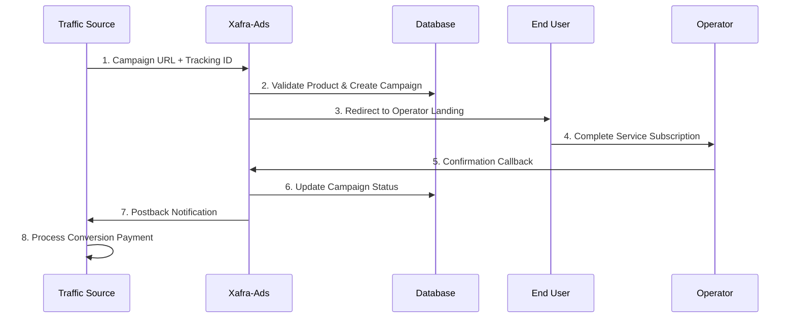
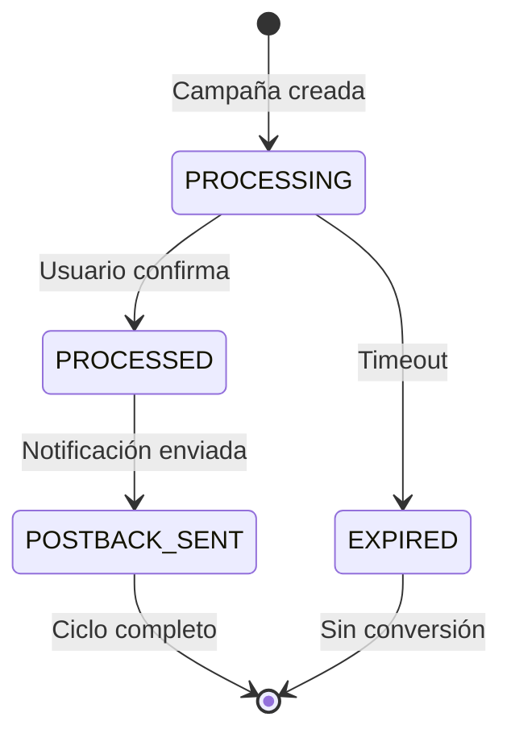
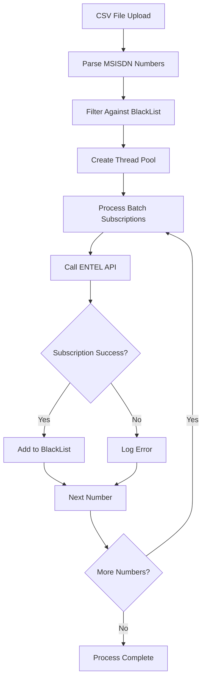

# 📊 Lógica de Negocio - Xafra-Ads

## 🎯 Visión General

Xafra-Ads es una plataforma que actúa como intermediario en el ecosistema de promoción de servicios digitales, conectando fuentes de tráfico (traffic sources) con operadores de telecomunicaciones para facilitar la contratación de servicios.

## 🔄 Flujo Principal de Negocio

### 📈 Workflow Completo: Traffic Source → Conversion → Postback



## 🏗️ Estructura Jerárquica del Sistema

### 🏢 Customer → Product → Campaign

```
Customer (Cliente/Traffic Source)
├── id: Identificador único del cliente
├── name: Nombre comercial
├── contact: Información de contacto
└── Products[] (Productos promocionados)
    ├── productId: ID único del producto
    ├── customerId: Relación con el cliente
    ├── urlRedirectSuccess: URL de contratación del operador
    ├── urlRedirectPostBack: URL de postback al traffic source
    ├── methodPostBack: Método HTTP (GET/POST)
    └── Campaigns[] (Campañas por producto)
        ├── campaignId: ID único de la campaña
        ├── productId: Relación al producto
        ├── trackingId: ID de seguimiento único
        ├── status: Estado (PROCESSING/PROCESSED)
        ├── statusPostBack: Estado postback (0/1)
        ├── creationDate: Timestamp de creación
        └── updateDate: Timestamp de actualización
```

## 🔍 Tipos de Tracking ID

### 🎯 External Tracking ID (Proporcionado por Traffic Source)

Cuando el traffic source proporciona su propio tracking ID:

```http
GET /ads/ABC123/? clickId=EXTERNAL_TRACK_12345
```

**Proceso**:
1. Sistema detecta parámetro de tracking en URL
2. Extrae `clickId=EXTERNAL_TRACK_12345`
3. Usa este ID como tracking para toda la campaña
4. En postback: `urlRedirectPostBack?tracking=EXTERNAL_TRACK_12345`

### 🎲 Internal Tracking ID (Generado por Sistema)

Cuando NO se proporciona tracking ID externo:

```http
GET /ads/ABC123/
```

**Proceso**:
1. Sistema detecta ausencia de tracking parameters
2. Genera UUID interno: `f47ac10b-58cc-4372-a567-0e02b2c3d479`
3. Usa UUID como tracking para la campaña
4. En postback: `urlRedirectPostBack?tracking=f47ac10b-58cc-4372-a567-0e02b2c3d479`

## 📝 Parámetros de Tracking Soportados

El sistema reconoce automáticamente estos parámetros (en orden de prioridad):

```java
// Lista de parámetros reconocidos
1. "ClickId"   - Estándar industria (mayúscula)
2. "clickId"   - CamelCase variant
3. "ClickID"   - Uppercase variant  
4. "clickID"   - Mixed case
5. "tracker"   - Parámetro genérico
```

**Ejemplo de detección**:
```http
/ads/ABC123/?utm_source=google&clickId=TRACK_001&utm_medium=cpc
                                ↑
                         Detectado automáticamente
```

## 🔄 Estados de Campaña

### 📊 Ciclo de Vida de una Campaña



### 🏷️ Estados Disponibles

| Estado | Valor | Descripción |
|--------|-------|-------------|
| **PROCESSING** | 0 | Campaña activa, esperando conversión |
| **PROCESSED** | 1 | Usuario completó acción, conversión confirmada |
| **statusPostBack** | 0/1 | Estado del postback (0=pendiente, 1=enviado) |

## 🔗 Reemplazo de Parámetros en URLs

### 🎯 Template `<TRAKING>` 

El sistema utiliza un sistema de templates para insertar tracking IDs dinámicamente:

**Configuración en Producto**:
```json
{
  "urlRedirectSuccess": "https://operator.com/landing?user_id=<TRAKING>&product=premium",
  "urlRedirectPostBack": "https://trafficsource.com/postback?click_id=<TRAKING>&status=conversion"
}
```

**Reemplazo en Runtime**:
```java
// Para urlRedirectSuccess
url = url.replaceAll("<TRAKING>", trackingId);
// Resultado: https://operator.com/landing?user_id=TRACK_001&product=premium

// Para urlRedirectPostBack  
url = url.replaceAll("<TRAKING>", trackingId);
// Resultado: https://trafficsource.com/postback?click_id=TRACK_001&status=conversion
```

## 📤 Sistema de Postbacks

### 🔔 Notificaciones Automáticas

Cuando se confirma una conversión (`/ads/confirm/{tracking}`):

**Proceso de Postback**:
1. Sistema localiza campaña por tracking ID
2. Obtiene configuración del producto asociado
3. Construye URL de postback reemplazando `<TRAKING>`
4. Ejecuta llamada HTTP asíncrona al traffic source
5. Actualiza `statusPostBack = 1` en base de datos

**Ejemplo de Implementación**:
```java
// CallConfirmTraking.java
protected boolean postBackAds(Product product, String tracking) {
    if (product.getUrlRedirectPostBack() != null) {
        String url = urlPostBack(product.getUrlRedirectPostBack(), tracking);
        String response = restClient.executeApi(
            method(product.getMethodPostBack()), 
            url, 
            null, 
            String.class, 
            null
        );
        return true;
    }
    return false;
}

private String urlPostBack(String url, String tracking) {
    return url.replaceAll("<TRAKING>", tracking);
}
```

## 🚫 Módulo BlackList

### 🛡️ Control Anti-Duplicados

**Propósito**: Prevenir suscripciones duplicadas por número telefónico (MSISDN)

**Estructura de BlackList**:
```java
public class BlackList {
    private Long id;
    private String msisdn;        // Número telefónico
    private Date creationDate;    // Fecha de inserción
    private Long productId;       // Producto específico
    private Integer type;         // Tipo de blacklist (1,2,etc)
}
```

**Flujo de Validación**:
1. Usuario solicita suscripción con MSISDN
2. Sistema consulta: `SELECT * FROM blacklist WHERE msisdn=? AND productId=?`
3. Si existe registro: **RECHAZAR** suscripción
4. Si no existe: **PROCEDER** con suscripción
5. Post-suscripción exitosa: **INSERTAR** en blacklist para futuras validaciones

## 🔄 Módulo AutoSuscripción

### 📁 Procesamiento Masivo de CSV

**Características**:
- Lectura de archivos CSV con números MSISDN
- Procesamiento multi-threading para alto rendimiento
- Integración con API ENTEL para activación automática
- Control de límites y horarios de ejecución

**Workflow AutoSuscripción**:


**Configuración de Límites**:
```http
POST /v1/auto/subscribe/{productId}/{hour}/{timeSleep}/{source}/{limit}
```

- `hour`: Hora de procesamiento (ej: "23" para 11 PM)
- `timeSleep`: Milisegundos entre requests (control de rate limiting)
- `source`: Código de fuente para tracking (ej: "AA230")
- `limit`: Máximo números a procesar en esta ejecución

## 🔐 Sistema de Autenticación

### 🗝️ API Keys y Encriptación

**Métodos de Autenticación**:
1. **Header-based**: Validación por headers HTTP específicos
2. **API Key**: Rutas protegidas con `/v1/confirm/{apikey}/{tracking}`
3. **Encriptación AES**: Parámetros sensibles encriptados en URLs

**Configuración de Seguridad**:
- Encriptación AES para product IDs en URLs de campaña
- API keys únicas por cliente en base de datos `auth_users`
- Validación de headers para endpoints administrativos

## 📊 Métricas y Performance

### 📈 Volumen de Datos Actual

- **Campañas Totales**: 2,970,685 registros activos
- **Base de Datos**: PostgreSQL 13.21 en GCP
- **Conexión**: 34.28.245.62:5432
- **Uptime**: Sistema en producción estable

### 🚀 Capacidad de Procesamiento

- **Threading**: Procesamiento asíncrono para postbacks
- **Pool Connections**: Gestión optimizada de conexiones BD
- **Rate Limiting**: Control de velocidad en auto-suscripciones
- **Monitoring**: Health checks en `/v1/ping` y `/v1/db/health`

---

📚 **Documentación Técnica**: Ver ARCHITECTURE.md  
🔧 **Setup de Desarrollo**: Ver INSTALL.md  
📋 **Análisis Detallado**: Ver ANÁLISIS_PROYECTO_XAFRA-ADS.md
