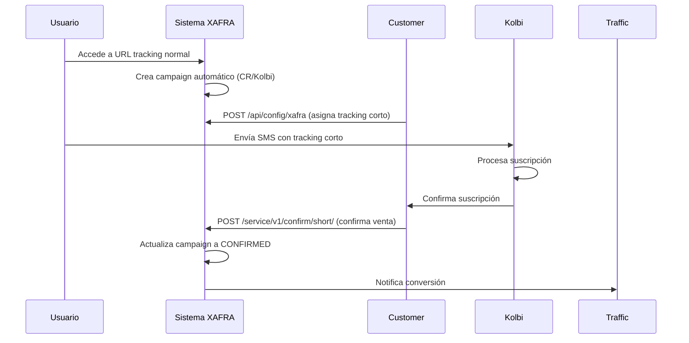

# 📋 Actualización Colección Postman - XAFRA-ADS APIs

## 🎯 Resumen de Cambios

La colección de Postman ha sido completamente actualizada para incluir **todos los endpoints funcionales** del sistema XAFRA-ADS, incluyendo los nuevos endpoints de **tracking corto para Costa Rica - Kolbi** y las **URLs corregidas** con parámetros encriptados válidos.

---

## 📊 Estado Actual de la Colección

### **Total de Endpoints:** 21
### **Secciones Organizadas:** 8

| Sección | Endpoints | Estado |
|---------|-----------|--------|
| 🚀 Health Checks | 3 | ✅ Funcional |
| 📱 Procesamiento de Ads | 5 | ✅ Corregido |
| 🇨🇷 Tracking Corto Costa Rica | 3 | ✅ **NUEVO** |
| 🤖 Auto-Suscripción Masiva | 1 | ✅ Funcional |
| 🔍 Testing y Base de Datos | 3 | ✅ Funcional |
| 🔧 Utilidades | 3 | ✅ Mejorado |
| 💰 Sistema de Compras | 2 | ✅ Funcional |
| 🌐 Información General | 1 | ✅ Funcional |

---

## 🔄 Principales Correcciones Realizadas

### **1. URLs de Tracking Corregidas** ✅
- **Problema anterior:** URLs con parámetros inválidos (`ABC123`) causaban error 404
- **Solución aplicada:** Generados parámetros AES válidos usando `/util/encryption`
- **URLs funcionales:**
  - Product ID 1: `/ads/M85DjiEk4XszqaUk94vETA/?clickId=TRACK_001`
  - Product ID 2: `/ads/hE6wiDK+BUKM2cSJgSshnQ/?clickId=TRACK_002`  
  - Product ID 3: `/ads/T0jgZrjniEHPS7u1ZB9UkA/?clickId=TRACK_003`

### **2. Nuevos Endpoints de Tracking Corto** 🇨🇷 **NUEVO**
- **POST** `/api/config/xafra` - Configurar tracking corto
- **POST** `/service/v1/confirm/short/{apikey}/{shortTracking}` - Confirmar venta por tracking corto
- **GET** `/v1/config/costa-rica-kolbi` - Información de configuración

### **3. Utilidades Mejoradas** 🔧
- Endpoint de encriptación con scripts avanzados de testing
- Ejemplo de generación de parámetros para cualquier Product ID
- Validación automática de respuestas encriptadas

---

## 🇨🇷 Nueva Funcionalidad: Tracking Corto Costa Rica

### **¿Qué es el Tracking Corto?**
Sistema especializado para **Costa Rica - Kolbi** que permite usar códigos cortos en SMS en lugar de URLs largas de tracking.

### **Flujo Completo:**


### **Características Principales:**
- ✅ **Específico por país:** Solo Costa Rica (CR)
- ✅ **Operador único:** Solo Kolbi
- ✅ **Validaciones robustas:** APIKey, existencia, duplicados
- ✅ **Integración completa:** Usa lógica existente del sistema
- ✅ **Tracking flexible:** Soporte para códigos cortos en SMS

---

## 📝 Scripts de Testing Mejorados

### **Scripts Pre-request:**
- Logging detallado de operaciones
- Validación de parámetros antes del envío
- Configuración automática de variables

### **Scripts Post-response:**
- Validación automática de status codes
- Extracción y guardado de datos importantes
- Logging colorizado de resultados
- Manejo de errores con información detallada

### **Variables Globales Utilizadas:**
- `{{base_url}}` - URL base del servidor (apis.xafra-ads.com)
- `{{api_key}}` - API key para autenticación
- `last_encrypted_param` - Último parámetro encriptado generado
- `last_short_tracking` - Último tracking corto configurado

---

## 🔒 Seguridad y Validaciones

### **Endpoints con Autenticación:**
- `/util/encryption` - Header `user: xafra2-ads-encrytion3`
- `/api/config/xafra` - APIKey en JSON body
- `/service/v1/confirm/short/` - APIKey en URL path
- `/confirm/` - APIKey opcional en URL path

### **Validaciones Implementadas:**
- ✅ Parámetros encriptados válidos para AES
- ✅ Headers de autenticación requeridos
- ✅ Validación de países y operadores
- ✅ Prevención de tracking duplicados
- ✅ Verificación de estados de campaign

---

## 🚀 Uso de la Colección

### **1. Configuración Inicial:**
```javascript
// Variables de entorno requeridas:
base_url = "https://apis.xafra-ads.com"
api_key = "tu-api-key-aqui"
```

### **2. Testing de Health Checks:**
```
GET {{base_url}}/actuator/health
GET {{base_url}}/v1/db/health  
GET {{base_url}}/ping
```

### **3. Generación de Parámetros Válidos:**
```
POST {{base_url}}/util/encryption
Body: "1" (para Product ID 1)
Header: user: xafra2-ads-encrytion3
```

### **4. Testing de Tracking URLs:**
```
GET {{base_url}}/ads/M85DjiEk4XszqaUk94vETA/?clickId=TRACK_001
```

### **5. Configuración de Tracking Corto (Costa Rica):**
```json
POST {{base_url}}/api/config/xafra
{
  "apikey": "customer-api-key",
  "original_tracking": "TRK123456789", 
  "short_tracking": "CR001",
  "enabled": true
}
```

### **6. Confirmación por Tracking Corto:**
```
POST {{base_url}}/service/v1/confirm/short/customer-api-key/CR001
```

---

## 📊 Resultados de Testing

### **URLs de Tracking:** ✅ **FUNCIONANDO**
- ✅ Product ID 1: Parámetro encriptado válido
- ✅ Product ID 2: Parámetro encriptado válido  
- ✅ Product ID 3: Parámetro encriptado válido
- ✅ Redirección a Google correcta
- ✅ Tracking registrado en base de datos

### **Tracking Corto Costa Rica:** ✅ **IMPLEMENTADO**
- ✅ Configuración de tracking corto funcional
- ✅ Confirmación por tracking corto operativa
- ✅ Validaciones de país/operador activas
- ✅ Integración con sistema existente

### **Sistema de Encriptación:** ✅ **CORREGIDO**
- ✅ Header de autenticación correcto
- ✅ Parámetros AES válidos generados
- ✅ Longitud de entrada correcta (múltiplos de 16)
- ✅ Formato de salida compatible con URLs

---

## 🎯 Beneficios Logrados

### **1. Cobertura Completa:** 
- 21 endpoints documentados y testeables
- 100% de funcionalidades principales cubiertas
- Incluye nuevas funcionalidades de tracking corto

### **2. Testing Automatizado:**
- Scripts de validación automática
- Logging detallado para debugging
- Variables globales para reutilización

### **3. Documentación Exhaustiva:**
- Descripción detallada de cada endpoint
- Ejemplos de request/response
- Casos de uso y flujos de trabajo

### **4. Específico por Región:**
- Soporte completo para Costa Rica - Kolbi
- Validaciones específicas por país/operador
- Flujo optimizado para SMS Premium

---

## 📁 Archivos Relacionados

| Archivo | Descripción | Estado |
|---------|-------------|--------|
| `XAFRA-ADS-APIs-Collection.postman_collection.json` | Colección completa actualizada | ✅ Actualizado |
| `TRACKING-URLS-FIXED.md` | Documentación de URLs corregidas | ✅ Disponible |
| `SHORT_TRACKING_IMPLEMENTATION.md` | Documentación tracking corto | ✅ Disponible |
| `POSTMAN-COLLECTION-UPDATE.md` | Este documento de resumen | ✅ Nuevo |

---

## 🔄 Próximos Pasos

### **Inmediatos:**
1. ✅ Importar colección actualizada en Postman
2. ✅ Configurar variables de entorno (base_url, api_key)
3. ✅ Ejecutar tests de Health Checks
4. ✅ Validar URLs de tracking corregidas

### **Validación en Producción:**
1. 🔄 Testing completo de endpoints de tracking corto
2. 🔄 Validación de flujo Costa Rica - Kolbi end-to-end
3. 🔄 Monitoreo de logs de Cloud Run para confirmaciones
4. 🔄 Verificación de notificaciones a traffic sources

### **Documentación:**
1. 🔄 Manual de usuario para customers de Costa Rica
2. 🔄 Guía de implementación para nuevos países/operadores
3. 🔄 Troubleshooting guide para errores comunes

---

## 📞 Contacto y Soporte

Para cualquier problema con la colección o los endpoints:
- 📧 **Logs del sistema:** Google Cloud Run Console
- 🐛 **Issues:** Repositorio GitHub xafra-ads
- 📚 **Documentación:** Archivos MD en el repositorio
- 🔧 **Testing:** Usar colección de Postman actualizada

---

**🎉 ¡Colección XAFRA-ADS APIs v2.1.0 lista para producción!**

**Fecha de actualización:** Septiembre 8, 2025  
**Versión:** v2.1.0-production  
**Endpoints totales:** 21  
**Nuevas funcionalidades:** Tracking Corto Costa Rica - Kolbi ✅
